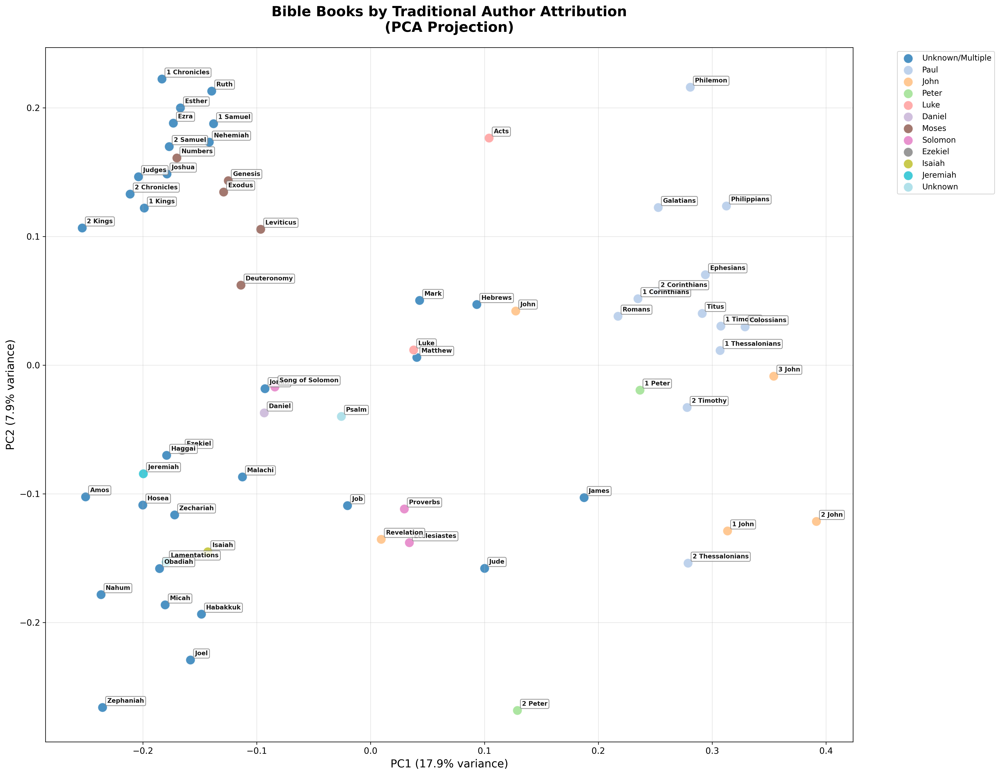

# 📖 Enhanced Bible Embeddings Analysis

*Generated on: 2025-07-06 20:08:31*

**Data Source**: Neon Database (single source of truth)

## 📊 Dataset Overview

- **Total books analyzed**: 66
- **Old Testament books**: 39
- **New Testament books**: 27
- **Total chapters**: 1189
- **Total verses**: 31,086

## 🎨 Visualizations

### 1. Testament Separation Analysis


**Analysis**: PCA projection showing how well Old and New Testament books separate in embedding space.

### 2. Biblical Book Categories


**Analysis**: Books grouped by literary and theological categories (Law, Wisdom, Prophets, Gospels, Epistles, etc.).

### 3. Raw 2D Clusters (t-SNE)


**Analysis**: t-SNE projection revealing natural clusters and relationships between books.

### 4. Category Similarity Matrix


**Analysis**: Heatmap showing average similarities between different biblical book categories.

### 5. Cross-Testament Convergence


**Analysis**: Detailed heatmap showing similarities between every OT and NT book pair.

### 6. Chapter-Level Analysis


**Analysis**: How chapters cluster within individual books, showing narrative progression.

### 7. Author Analysis


**Analysis**: Books grouped by traditional author attribution (Moses, Paul, John, etc.).

### 8. Literary Genre Analysis


**Analysis**: Books categorized by literary genre (Narrative, Poetry, Prophetic, Legal, Epistolary, Apocalyptic).

### 9. Network Analysis


**Analysis**: Network graph showing high-similarity connections between books.

### 10. Interactive Visualization
🌐 **[Open Interactive Analysis](../interactive_bible_analysis.html)** (requires modern web browser)

**Features**: Zoom, pan, hover details, and multiple perspective views in one interactive interface.

## 🔍 Testament Analysis

### Quantitative Separation Analysis
- **OT ↔ NT similarity**: 0.903
- **Average OT internal similarity**: 0.795
- **Average NT internal similarity**: 0.780

### 📈 Interpretation
⚠️ **Limited separation**: Old and New Testaments show significant thematic overlap. This could indicate strong continuity in themes across testaments.

## 🔄 Top Cross-Testament Similarities

These book pairs show the highest thematic similarity across testaments:

1. **Daniel** ↔ **Revelation**: `0.863`
2. **Ezekiel** ↔ **Revelation**: `0.859`
3. **Isaiah** ↔ **Revelation**: `0.850`
4. **Ezekiel** ↔ **Matthew**: `0.848`
5. **Ezekiel** ↔ **Luke**: `0.844`
6. **Isaiah** ↔ **Matthew**: `0.840`
7. **Genesis** ↔ **Matthew**: `0.835`
8. **1 Kings** ↔ **Luke**: `0.834`
9. **Jeremiah** ↔ **Matthew**: `0.833`
10. **Isaiah** ↔ **Luke**: `0.832`

## 📚 Individual Book Analysis

### 📖 Genesis
Most semantically similar books:
1. **Judges** (OT, Historical): `0.891`
2. **Joshua** (OT, Historical): `0.881`
3. **Exodus** (OT, Law (Torah)): `0.880`
4. **Numbers** (OT, Law (Torah)): `0.879`
5. **Deuteronomy** (OT, Law (Torah)): `0.873`

### 📖 Isaiah
Most semantically similar books:
1. **Ezekiel** (OT, Major Prophets): `0.927`
2. **Jeremiah** (OT, Major Prophets): `0.921`
3. **Psalm** (OT, Other): `0.891`
4. **Micah** (OT, Minor Prophets): `0.887`
5. **Lamentations** (OT, Major Prophets): `0.872`

### 📖 Matthew
Most semantically similar books:
1. **Luke** (NT, Gospels): `0.971`
2. **Mark** (NT, Gospels): `0.964`
3. **John** (NT, Gospels): `0.932`
4. **Acts** (NT, Early Church): `0.866`
5. **Ezekiel** (OT, Major Prophets): `0.848`

### 📖 Romans
Most semantically similar books:
1. **1 Corinthians** (NT, Paul's Epistles): `0.888`
2. **Galatians** (NT, Paul's Epistles): `0.876`
3. **2 Corinthians** (NT, Paul's Epistles): `0.873`
4. **Colossians** (NT, Paul's Epistles): `0.862`
5. **Philippians** (NT, Paul's Epistles): `0.855`

### 📖 Revelation
Most semantically similar books:
1. **Daniel** (OT, Major Prophets): `0.863`
2. **Ezekiel** (OT, Major Prophets): `0.859`
3. **Isaiah** (OT, Major Prophets): `0.850`
4. **Matthew** (NT, Gospels): `0.842`
5. **Luke** (NT, Gospels): `0.827`

## 📋 Book Categories

**Law (Torah)**: Genesis, Exodus, Leviticus, Numbers, Deuteronomy

**Historical**: Joshua, Judges, Ruth, 1 Samuel, 2 Samuel, 1 Kings, 2 Kings, 1 Chronicles, 2 Chronicles, Ezra, Nehemiah, Esther

**Wisdom**: Job, Psalms, Proverbs, Ecclesiastes, Song of Solomon

**Major Prophets**: Isaiah, Jeremiah, Lamentations, Ezekiel, Daniel

**Minor Prophets**: Hosea, Joel, Amos, Obadiah, Jonah, Micah, Nahum, Habakkuk, Zephaniah, Haggai, Zechariah, Malachi

**Gospels**: Matthew, Mark, Luke, John

**Early Church**: Acts

**Paul's Epistles**: Romans, 1 Corinthians, 2 Corinthians, Galatians, Ephesians, Philippians, Colossians, 1 Thessalonians, 2 Thessalonians, 1 Timothy, 2 Timothy, Titus, Philemon

**General Epistles**: Hebrews, James, 1 Peter, 2 Peter, 1 John, 2 John, 3 John, Jude

**Apocalyptic**: Revelation

## 💾 Data Files

Analysis data is available in structured formats:
- `../data/book_analysis.csv` - Book metadata and categories
- `../data/chapter_analysis.csv` - Chapter-level data
- `../data/book_similarities.csv` - Similarity matrix
- `../data/book_categories.json` - Category definitions

## 🔧 Technical Details

### Methodology
- **Embedding Model**: Google text-embedding-004 (768 dimensions)
- **Dimensionality Reduction**: PCA and t-SNE for visualization
- **Similarity Metric**: Cosine similarity
- **Clustering**: Natural groupings based on embedding similarities
- **Categories**: Traditional biblical literary/theological classifications

### File Structure
```
results/
├── images/          # PNG visualizations
├── reports/         # Analysis reports
└── data/           # Raw data exports
```

---
*This enhanced analysis was generated using embeddings-based semantic analysis with multiple visualization techniques.*
